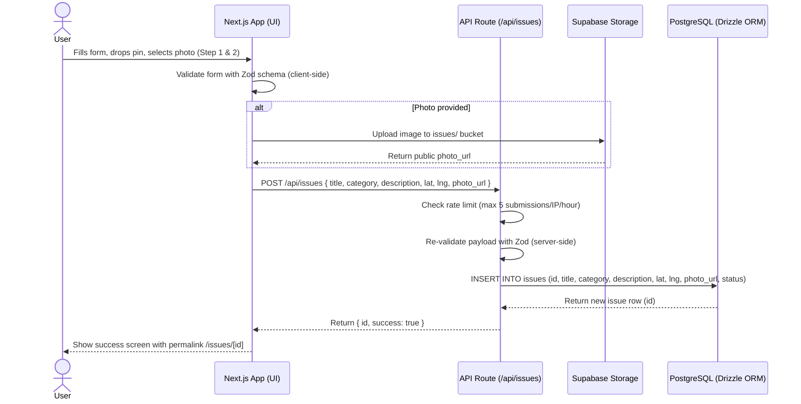
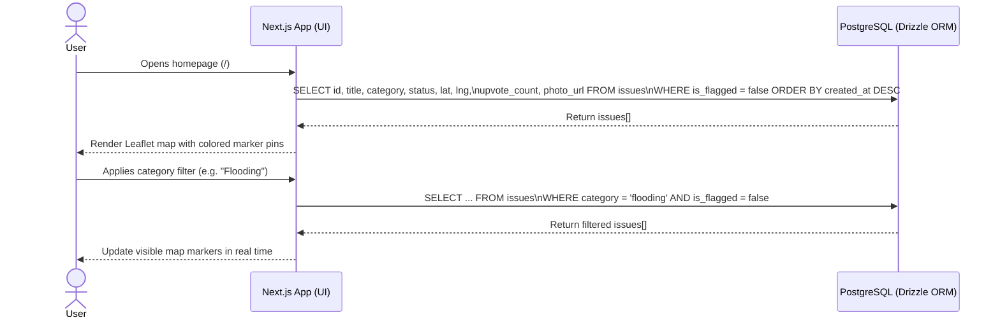
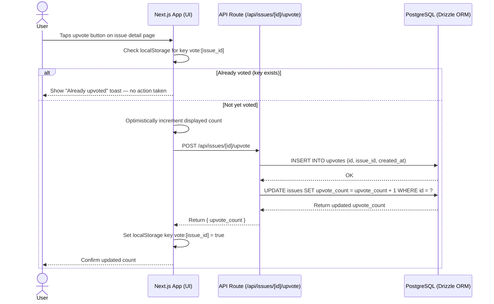

# LaporSek — Product Requirements Document · v1.0

🗺️ **LaporSek — Community Issue Reporter**

*Version 1.0 · June 2026*

---

## Table of Contents

1. [Product Overview](#1-product-overview)
2. [Tech Stack](#2-tech-stack)
3. [Features & Requirements](#3-features--requirements)
4. [Data Model](#4-data-model)
5. [Database Sequence Diagram](#5-database-sequence-diagram)
6. [UX & Design Guidelines](#6-ux--design-guidelines)
7. [Core User Flow](#7-core-user-flow)
8. [Edge Cases & Error Handling](#8-edge-cases--error-handling)
9. [Success Metrics](#9-success-metrics)
10. [Open Questions & Future Considerations](#10-open-questions--future-considerations)

---

## 1. Product Overview

### 1.1 Product Name

LaporSek

### 1.2 One-Line Description

A web app where anyone can pin, photo, and upvote local infrastructure problems — turning community frustration into a visible, shareable map of issues that need fixing.

### 1.3 Problem Statement

Broken streetlights, flooded roads, damaged footpaths, and overflowing waste bins are daily realities in many neighborhoods — yet they often go unreported because there's no easy, low-friction way to document them. Existing government reporting channels require accounts, bureaucratic forms, or specific knowledge of which department to contact. Meanwhile, residents don't know if their neighbors share the same frustration, and local problems remain invisible to the wider community. LaporSek solves this by giving anyone with a phone and a browser a simple way to pin issues on a shared map, add a photo, and let the community upvote what matters most.

### 1.4 Target Users

- Residents who want to report local infrastructure issues without creating an account
- Commuters who encounter road damage, flooding, or safety hazards during their daily travel
- Community organizers and neighborhood leaders who want to aggregate and surface local complaints
- Local government officials or journalists looking for prioritized, crowd-validated issue data

### 1.5 Goals

- Allow anyone to submit a local issue in under 60 seconds, no account required
- Surface the most-upvoted and most-recent issues on a shared interactive map
- Make all data publicly browsable and shareable as individual issue permalinks
- Show community validation (upvotes, status) to demonstrate real-world impact over time

### 1.6 Non-Goals (v1)

- Official government integration or automated ticket routing
- User accounts, login, or profile management
- Comments or discussion threads on issues
- Push notifications or email alerts
- Native mobile app (web-only at launch)
- Full moderation dashboard (basic spam prevention only)

---

## 2. Tech Stack

### 2.1 Core Technologies

| Feature | Technology | Description |
|---|---|---|
| **Framework** | Next.js 14 (App Router) | Full-stack React framework with SSR, API routes, and file-based routing |
| **Language** | TypeScript | Static typing throughout for safety and developer experience |
| **Styling** | Tailwind CSS | Utility-first CSS — fast to build, consistent design tokens |
| **Database** | PostgreSQL (via Supabase) | Hosted relational DB with real-time subscriptions and row-level security |
| **ORM** | Drizzle ORM | Type-safe SQL queries and schema migrations, zero runtime overhead |
| **File Storage** | Supabase Storage | Issue photo uploads stored in a public bucket with CDN delivery |
| **Map** | Leaflet.js + React-Leaflet | Lightweight, open-source interactive map — no Google Maps API key required |
| **Auth** | None (v1) | Anonymous submission; browser localStorage used solely for upvote deduplication |
| **Deployment** | Vercel | Zero-config deployment for Next.js with edge functions and global CDN |

### 2.2 Key Libraries Used

- **react-leaflet** — React wrapper for Leaflet.js with marker, popup, and tile layer components
- **leaflet.markercluster** — Clusters nearby issue markers to prevent map clutter at low zoom levels
- **@supabase/supabase-js** — Official JS client for database queries and file uploads
- **react-hook-form + zod** — Form state management and schema validation on the submission form
- **react-dropzone** — Drag-and-drop photo upload component with instant preview
- **next/image** — Optimized image delivery for issue photo thumbnails
- **date-fns** — Human-readable timestamps ("3 hours ago", "2 days ago")

---

## 3. Features & Requirements

### 3.1 Interactive Map View (Home)

The landing page centers on a full-viewport interactive map showing all reported issues as category-colored pins.

#### 3.1.1 Map Display

- Full-viewport Leaflet map as the primary UI, default centered on user's geolocation (fallback: Jakarta city center at `-6.2088, 106.8456`)
- Each issue rendered as a colored marker pin based on its category (e.g. red for Road Damage, blue for Flooding)
- Marker clusters auto-merge nearby pins at lower zoom levels using leaflet.markercluster
- Clicking a cluster zooms in to reveal individual markers
- Clicking a marker opens a compact popup with: issue title, category badge, upvote count, photo thumbnail, and a "View details" link
- Map tiles served from OpenStreetMap (free, no API key required)

#### 3.1.2 Filter & Search Bar

- A floating bar overlaid at the top-center of the map contains:
  - Category filter: multi-select dropdown (Road Damage, Flooding, Street Lighting, Waste & Garbage, Public Facility, Other)
  - Status filter: toggle group — All / Open / In Progress / Resolved
  - Search input: fuzzy text search across issue titles
- Filtering updates the visible map pins in real time without a page reload
- A "Reset filters" link appears when any filter or search is active

### 3.2 Issue Submission

Accessible via a prominent "Report an Issue" floating action button on the map. Opens a two-step modal on desktop, or a full-page view on mobile.

#### 3.2.1 Submission Form — Step 1 (Details)

- **Title** — text input, required, max 100 characters
- **Category** — single-select dropdown: Road Damage, Flooding, Street Lighting, Waste & Garbage, Public Facility, Other
- **Description** — textarea, optional, max 500 characters, shows character counter
- **Photo** — single image upload (JPEG/PNG, max 5MB), optional but strongly encouraged; preview shown immediately after selection via react-dropzone

#### 3.2.2 Submission Form — Step 2 (Location)

- Interactive mini-map where the user drops a single draggable pin to mark the issue location
- Defaults to browser geolocation if permission is granted; otherwise defaults to Jakarta city center
- An address search input above the mini-map lets the user type a location and geocode it (via Nominatim)
- Location is required — the "Submit" button is disabled until a pin is placed

#### 3.2.3 Submission Behavior

- Client-side validation via Zod schema runs before the API call
- On submit: if a photo was selected, it is uploaded to Supabase Storage first; the returned public URL is then included in the issue record
- A success screen appears with the submitted issue's permalink and a "Share" button
- No account, email, or personal information is required to submit

#### 3.2.4 Spam Prevention

- Rate limit: max 5 submissions per IP address per hour, enforced in the Next.js API route middleware
- A hidden honeypot field catches basic bot submissions
- Submitted issues are marked `is_flagged = true` automatically if 3 or more users report the same issue

### 3.3 Issue Detail Page

Each issue has a dedicated public URL at `/issues/[id]`.

- Full-width photo at the top if one was uploaded (hidden section if no photo)
- Issue title, category badge, and status badge in the header
- Submission timestamp displayed as a relative string ("Reported 2 hours ago")
- Full description text (if provided)
- Read-only mini-map showing the issue's pinned location
- Reverse-geocoded address label below the map (e.g. "Jl. Sudirman, Jakarta Selatan")
- Upvote button with current count — one vote per browser session, state persisted in localStorage
- "Report this issue" link for spam/inappropriate content flagging
- Share button: copies the page URL to clipboard with a "Copied!" confirmation toast

### 3.4 Upvoting

- Upvote button is available on both the issue detail page and the map popup
- One upvote per browser session per issue, tracked via a `vote:[issue_id]` key in localStorage
- Optimistic UI: displayed count increments immediately on click; reverts on API error
- The upvote is persisted to the `upvotes` table; `issues.upvote_count` is incremented atomically in the same API call for fast sorting

### 3.5 Issue List View

An alternate `/issues` page for users who prefer a card-based, text-first view over the map.

- Card grid layout (2 columns on desktop, 1 on mobile), sorted by newest first by default
- A sort toggle lets users switch to "Most upvoted"
- Each card shows: photo thumbnail, title, category badge, status badge, location label, upvote count, and relative timestamp
- Same category and status filters as the map view, displayed as a horizontal filter row above the grid
- Pagination: 20 issues per page with "Load more" button

### 3.6 Status Tracking

Issues have three statuses, representing the real-world lifecycle of a community report.

- **Open** — default status on all new submissions
- **In Progress** — acknowledged; someone is working on it
- **Resolved** — the issue has been fixed or addressed

Status can be updated via a lightweight admin page at `/admin/issues/[id]` protected by a hardcoded secret key in v1. Resolved issues remain on the map with a visually dimmed marker to preserve history.

---

## 4. Data Model

All data lives in a PostgreSQL database managed via Drizzle ORM, hosted on Supabase. Schema is versioned with Drizzle migrations.

| Table | Column | Type | Notes |
|---|---|---|---|
| **issues** | id | UUID | Primary key, default `gen_random_uuid()` |
| **issues** | created_at | TIMESTAMPTZ | Default `now()` |
| **issues** | title | TEXT | Not null, max 100 characters |
| **issues** | description | TEXT | Nullable |
| **issues** | category | TEXT | Enum: `road_damage`, `flooding`, `lighting`, `waste`, `facility`, `other` |
| **issues** | status | TEXT | Enum: `open`, `in_progress`, `resolved` — default `open` |
| **issues** | lat | NUMERIC(10,7) | Latitude of the pinned location |
| **issues** | lng | NUMERIC(10,7) | Longitude of the pinned location |
| **issues** | address | TEXT | Reverse-geocoded human-readable address, nullable |
| **issues** | photo_url | TEXT | Supabase Storage public URL, nullable |
| **issues** | upvote_count | INTEGER | Denormalized count for fast sorting, default `0` |
| **issues** | is_flagged | BOOLEAN | Default `false` — set to `true` when ≥3 reports received |
| **upvotes** | id | UUID | Primary key |
| **upvotes** | issue_id | UUID (FK) | References `issues.id`, on delete cascade |
| **upvotes** | created_at | TIMESTAMPTZ | Default `now()` |
| **reports** | id | UUID | Primary key |
| **reports** | issue_id | UUID (FK) | References `issues.id`, on delete cascade |
| **reports** | created_at | TIMESTAMPTZ | Default `now()` |

---

## 5. Database Sequence Diagram

The diagrams below illustrate how the app interacts with PostgreSQL (via Drizzle ORM on Supabase) across the core user flows.

### 5.1 Primary Flow — Submit an Issue



### 5.2 Loading the Map — Fetch & Display Issues



### 5.3 Upvote an Issue



### 5.4 Admin — Update Issue Status

```mermaid
sequenceDiagram
    actor Admin
    participant Page as Admin Page (/admin/issues/[id])
    participant API as API Route (/api/admin/issues/[id])
    participant DB as PostgreSQL (Drizzle ORM)

    Admin->>Page: Opens admin URL with ?key= query param
    Page->>Page: Compare ?key= value against ADMIN_SECRET env var

    alt Invalid key
        Page-->>Admin: Return 403 — "Access denied"
    else Valid key
        Page->>DB: SELECT * FROM issues WHERE id = ?
        DB-->>Page: Return issue row
        Page-->>Admin: Render issue detail with status selector

        Admin->>Page: Selects new status (e.g. "Resolved") → clicks Save
        Page->>API: PATCH /api/admin/issues/[id] { status: 'resolved' }
        API->>DB: UPDATE issues SET status = 'resolved' WHERE id = ?
        DB-->>API: OK
        API-->>Page: Return { success: true }
        Page-->>Admin: Show success toast; update displayed status badge
    end
```

---

## 6. UX & Design Guidelines

### 6.1 Visual Language

- **Theme:** Clean, civic, and trustworthy — inspired by public-service UIs and open mapping tools
- **Primary accent:** Blue (`#2563EB`) — used for CTAs, active filters, the upvote button, and links
- **Background:** White (`#FFFFFF`) for panels and modals; the map fills the remaining viewport
- **Typography:** `Inter` → `system-ui` → `sans-serif` — no custom font loading required
- **Corner radius:** 12px for cards and modals, 8px for buttons and inputs, 999px for category badge pills
- **Elevation:** Floating UI elements (filter bar, FAB) use a subtle `box-shadow` to lift visually off the map layer

### 6.2 Color Tokens

| Token | Value | Usage |
|---|---|---|
| **Primary** | `#2563EB` | CTA buttons, upvote button, active filter state, links |
| **Surface** | `#FFFFFF` | Panel, modal, card, and popup backgrounds |
| **Background** | `#F8FAFC` | Page background outside the map area |
| **Text Primary** | `#0F172A` | Headings and body text |
| **Text Secondary** | `#64748B` | Timestamps, hints, and secondary labels |
| **Status: Open** | `#F59E0B` | Amber — Open status badge |
| **Status: In Progress** | `#3B82F6` | Blue — In Progress status badge |
| **Status: Resolved** | `#22C55E` | Green — Resolved status badge |
| **Destructive** | `#EF4444` | Flag / report actions |
| **Marker: Road Damage** | `#EF4444` | Red map pin |
| **Marker: Flooding** | `#3B82F6` | Blue map pin |
| **Marker: Street Lighting** | `#F59E0B` | Amber map pin |
| **Marker: Waste** | `#84CC16` | Lime green map pin |
| **Marker: Public Facility** | `#8B5CF6` | Purple map pin |
| **Marker: Other** | `#94A3B8` | Gray map pin |

### 6.3 Screen Map

| Screen | Key UI Elements | Notes |
|---|---|---|
| **Home / Map** | Full-viewport Leaflet map, floating filter bar, FAB "Report an Issue" | Primary entry point |
| **Submit Issue (Step 1)** | Title input, category dropdown, description textarea, photo dropzone | Modal on desktop, full-page on mobile |
| **Submit Issue (Step 2)** | Address search, interactive pin-drop mini-map, "Submit" CTA | Second step of the modal/page |
| **Submission Success** | Permalink, share button, "View on map" CTA | Shown immediately after a successful submit |
| **Issue Detail** | Full photo, title, category/status badges, description, location map, upvote button | Public URL at `/issues/[id]` |
| **Issue List** | Card grid, sort toggle, filter row, pagination | `/issues` — text-first alternative to the map |
| **Admin Panel** | Issue summary, status dropdown, save button | `/admin/issues/[id]?key=SECRET` |

### 6.4 Navigation Structure

**Top navigation bar** (minimal, overlaid on the map):

- Logo / "LaporSek" wordmark on the left
- "Browse Issues" link → `/issues`
- "Report an Issue" button (primary CTA) → opens submission modal

**Floating map elements:**

- Filter bar floats at the top-center of the map viewport
- "Report an Issue" FAB floats at the bottom-right of the map

There is no bottom tab bar — this is a web-first layout that avoids mobile-native navigation patterns.

### 6.5 Accessibility

- Minimum touch target size: 44×44px on all interactive elements
- All map markers have `aria-label` attributes describing the issue title and category
- Color is never the sole differentiator — category labels and icons accompany all colored badges and pins
- Form fields use explicit `<label>` elements; validation errors are announced via `aria-live="polite"`
- Keyboard-navigable filter dropdowns and map controls

---

## 7. Core User Flow

### 7.1 Primary Flow — Report an Issue

1. User opens the app → sees the map with existing issue pins and the floating filter bar
2. User taps the "Report an Issue" FAB → submission modal opens at Step 1
3. User fills in title, selects a category, optionally adds description and a photo
4. User taps "Next" → Step 2 opens with the pin-drop mini-map
5. User drops a pin on the map (or allows geolocation auto-fill) to mark the location
6. User taps "Submit" → client-side Zod validation runs
7. Photo (if provided) uploads to Supabase Storage; on success, the issue is inserted into PostgreSQL
8. Success screen appears with the permalink → user can share or return to the map
9. New issue pin appears on the main map

### 7.2 Alternate Flow — Browse & Upvote

1. User opens the app → sees the map with issue pins
2. User taps a marker → popup appears with issue title, category, photo thumbnail, and upvote count
3. User taps "View details" → issue detail page at `/issues/[id]` opens
4. User reads the description, sees the photo and pinned location on the mini-map
5. User taps the upvote button → count increments, vote stored in localStorage
6. User taps "Share" → page URL is copied to clipboard with a confirmation toast

### 7.3 Alternate Flow — Filter by Category

1. User opens the filter bar on the map
2. Selects "Flooding" from the category dropdown
3. Map updates to show only flooding-related pins in real time
4. User zooms in to their neighborhood to see local flooding reports
5. User adds "Open" to the status filter to hide already-resolved issues

### 7.4 Admin Flow — Update Issue Status

1. Admin opens `/admin/issues/[id]?key=ADMIN_SECRET` in their browser
2. Page validates the secret key — renders issue summary and status dropdown on success
3. Admin selects "Resolved" → clicks Save
4. API route updates the status in the database
5. Status badge updates to green "Resolved" across the map, list, and detail views

---

## 8. Edge Cases & Error Handling

| Scenario | Priority | Handling |
|---|---|---|
| **Geolocation permission denied** | Must Handle | Default map center to Jakarta; show "Allow location for auto-fill" prompt in Step 2 |
| **Photo upload fails** | Must Handle | Show error toast; allow resubmit without photo or offer retry |
| **Photo exceeds 5MB** | Must Handle | Client-side size check before upload attempt; show "Image too large — max 5MB" |
| **Non-image file uploaded** | Must Handle | Validate MIME type client-side; reject with "Please upload a JPEG or PNG image" |
| **Rate limit exceeded** | Must Handle | Return HTTP 429 with "Too many submissions — try again in an hour" |
| **No pin placed on map** | Must Handle | Disable "Submit" button; show inline error "Please drop a pin to mark the location" |
| **Issue ID not found** | Must Handle | Return 404 page: "This issue doesn't exist or has been removed" |
| **Upvote on already-voted issue** | Must Handle | Show "You've already upvoted this" toast; no duplicate database entry created |
| **Admin key is wrong** | Must Handle | Return 403 — "Access denied"; do not reveal that the admin route exists |
| **Map tiles fail to load** | Should Handle | Show overlay message: "Map unavailable — try refreshing" |
| **No issues match active filters** | Should Handle | Show empty state on map: "No issues found. Try adjusting your filters." |
| **Reverse geocoding fails** | Edge | Display raw lat/lng as the location label; do not block submission or rendering |
| **Very long title or description** | Should Handle | Enforce max-length at input level; truncate in list cards and popups with ellipsis |
| **Issue flagged by 3+ users** | Should Handle | Set `is_flagged = true`; hide from map and list pending manual admin review |

---

## 9. Success Metrics

Since LaporSek is a solo-built, free community tool, success is defined through usage signals and technical quality rather than business KPIs.

### 9.1 Performance Targets

- Time to Interactive (TTI) on homepage: under 3 seconds on a mid-range Android device on 4G
- Map renders all visible issue pins in under 1 second after data is fetched
- Issue submission (including photo upload) completes in under 5 seconds on a stable connection
- Issue detail page (SSR) responds in under 500ms at the Vercel edge

### 9.2 Functional Quality Gates

- Submission form validates all required fields and displays clear, field-level error messages before any API call is made
- Upvote deduplication works correctly — the same browser cannot upvote the same issue twice
- Newly submitted issues appear on the map within 5 seconds, without requiring a manual page refresh
- The map remains usable (pan, zoom, click markers) with up to 500 concurrent visible pins before clustering degrades UX
- The app is fully functional on the latest versions of Chrome, Firefox, and Safari on both desktop and mobile

---

## 10. Open Questions & Future Considerations

### 10.1 Open Questions

- Should flagged issues be hidden automatically or require manual admin approval before hiding?
    - Answer: hidden automatically
- Which reverse geocoding service to use — Nominatim (free, rate-limited) or a paid provider like Mapbox?
    - Answer: Nominatim
- Should the map default to Jakarta on every visit, or attempt geolocation on first load?
    - Answer: Jakarta
- Is a secret-key URL sufficient admin protection for v1, or should a proper login be implemented?
    - Answer: secret-key url sufficient

### 10.2 Future Considerations

- User accounts and issue ownership (edit or delete own submissions)
- Comments and discussion threads on each issue
- Email or push notifications when a nearby issue is reported or its status changes
- Shareable embed widget for local community websites and neighborhood blogs
- CSV / GeoJSON data export for journalists or researchers
- WhatsApp or Telegram bot for issue reporting without a browser